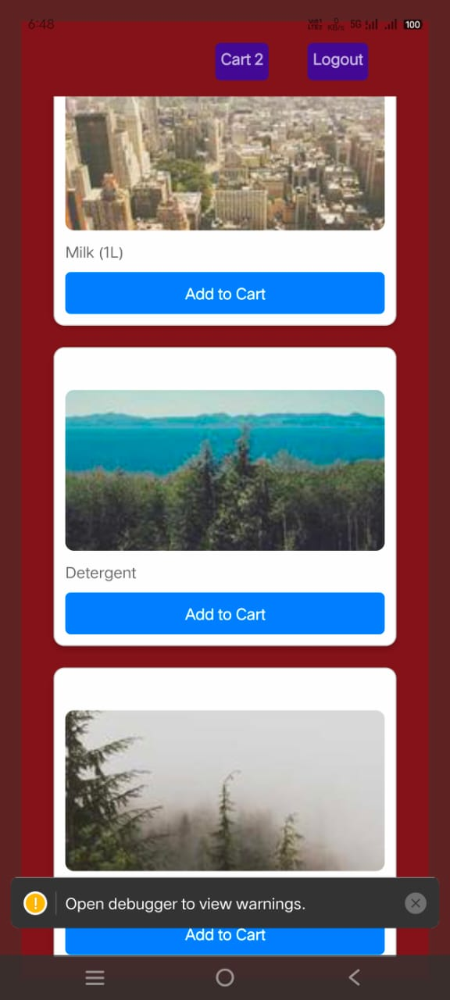
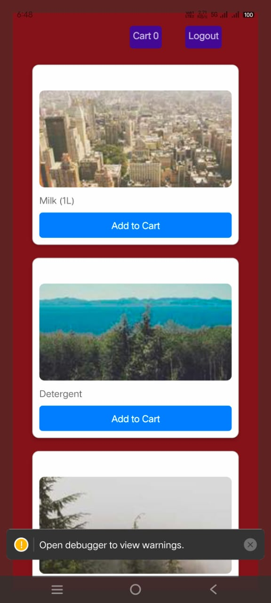

🛒 Snapmart - Quick Commerce App
Welcome to Snapmart, a lightning-fast and seamless quick commerce mobile application built using React Native. This capstone project showcases modern mobile development practices, intuitive UX, and a robust e-commerce flow tailored for speed and convenience.

<!-- (Optional: Add a cool banner or screenshot here) -->

🚀 Features
🔐 User Authentication – Secure login/signup flow with session management.

🏠 Home Dashboard – Displays curated categories and trending products.

🛍️ Product Browsing – Browse by categories, view product details.

🔍 Smart Search – Real-time product search with debounce handling.

🛒 Cart & Checkout – Add to cart, update quantity, and place orders.

🧾 Order Summary – Detailed invoice and order confirmation screen.

🌙 Dark/Light Mode – Toggle between themes for a better user experience.

📦 Order History – Track previous purchases with detailed information.

📱 Responsive Design – Adaptive layout for different device sizes.

⚛️ Modern Stack – Built using the latest React Native and best practices.

🧑‍💻 Tech Stack
React Native (Expo)

React Navigation (Stack, Tab, Drawer)

Zustatnd for global state

AsyncStorage for local persistence

Firebase (Auth & Firestore)

REST APIs for product and order data

Platform-Specific Components (iOS/Android optimizations)

Screenshots
## 🏠 Home Screen

The home screen displays trending categories and top picks for the day.

![Home Screen]

---

## 🛍️ Product Details

Each product page shows images, descriptions, and add-to-cart options.

![Product Details]

![Sign-up]

![Sign-in]

📂 Project Presentation link:https://drive.google.com/drive/folders/18yztnbpBkOZ9c_A5tCBSitOwi5f5zxJP?usp=sharing 

📂 Project Structure
bash
Copy
Edit
/src
  /assets        → Icons, images
  /components    → Reusable UI elements
  /contexts      → Context Providers
  /navigation    → Stack, Tab, and Drawer navigators
  /screens       → All app screens (Login, Home, Product, etc.)
  /services      → Firebase and API utilities
  /utils         → Helper functions and constants
App.js           → Entry point
🛠️ Setup Instructions
Clone the Repository

bash
Copy
Edit
git clone https://github.com/Udayasaran-kumar/capstone-quick-commerce-app.git
cd capstone-quick-commerce-app
Install Dependencies

bash
Copy
Edit
npm install
# or
yarn install
Run the App

bash
Copy
Edit
npx expo start
Scan the QR code using the Expo Go app on your phone or run on emulator/simulator.

Configure Firebase

Replace Firebase config inside /services/firebase.js with your own credentials from Firebase Console.

📸 Screenshots
<!-- Replace these with actual screenshots -->
Login	Home	Product Details	Cart	Order Summary
🧪 Future Enhancements
Payment gateway integration (Razorpay/Stripe)

Push notifications

Real-time delivery tracking

Wishlist and reviews

🙌 Acknowledgements
React Native

Firebase

Expo

Tailwind CSS

📬 Contact
Made with ❤️ by Udayasaran Kumar
For feedback or collaboration, reach out via LinkedIn or open an issue.